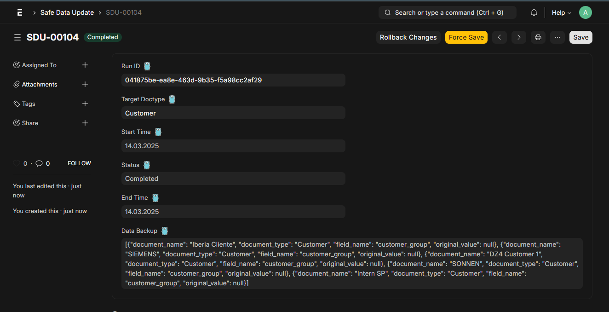
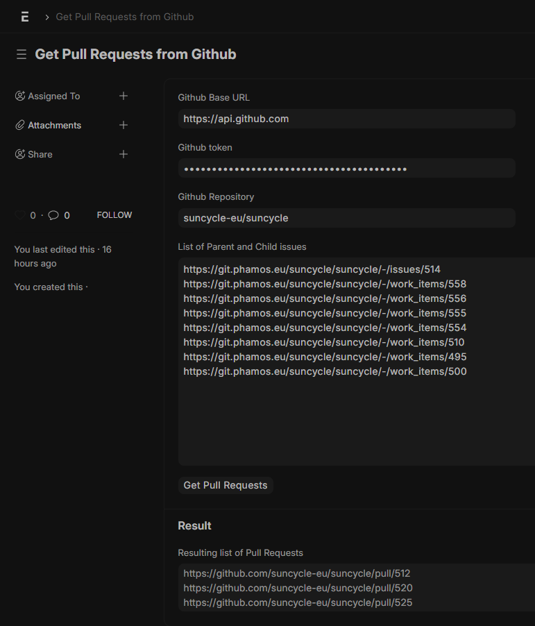

# Phamos Utils

Phamos Utils is a collection of utilities for managing and updating data in the Phamos ERP system. This app includes a robust mechanism for safely updating data with automatic backup and rollback capabilities.

## Safe Data Update

The `SafeDataUpdate` class provides a safe way to update fields in documents. It ensures that any changes made can be rolled back in case of an error. This is particularly useful for bulk updates or critical data modifications.

### Features

- **Backup**: Before any update, the original value of the field is backed up.
- **Update**: The field is updated with the new value.
- **Rollback**: If an error occurs during the update process, all changes can be rolled back to their original state.

### Usage

#### Example Update Function

The following example demonstrates how to use the `SafeDataUpdate` class to update the `customer_group` field of all `Customer` documents to "Commercial".

```python
from phamos_utils.phamos_utils.doctype.safe_data_update.safe_data_update import SafeDataUpdate
import frappe

def your_update_function(runner, **kwargs):
    """
    Example update function using safe_update.
    """
    for doc in frappe.get_all("Customer", fields=["name", "customer_group"]):
        runner.safe_update(doc.name, "customer_group", "Commercial")

# Create an instance of SafeDataUpdate
safe_data_update_instance = frappe.get_doc({"doctype": "Safe Data Update", "target_doctype": "Customer"})
safe_data_update_instance.insert()

# Run the test update function
safe_data_update_instance.run(your_update_function)
```

#### Graphical Interface / Rollback

After running this function, a new record of Safe Data Update will be created:



You can use the `Rollback Changes` button to restore the data to the original values.

### Class Methods

#### `safe_update(doc_name, field_name, new_value, update_modified=False)`

- **doc_name**: The name of the document to update.
- **field_name**: The field to update.
- **new_value**: The new value to set.
- **update_modified**: Whether to update the `modified` timestamp of the document.

#### `run(update_function, **kwargs)`

- **update_function**: The function that performs the updates. This function should call `safe_update` for each update.
- **kwargs**: Additional arguments to pass to the update function.

#### `rollback_changes()`

Rolls back all changes made during the update process.

### Logging

The `SafeDataUpdate` class uses Python's `logging` module to log information about the update process. Logs include information about successful updates, errors, and rollbacks.

## Get Pull Requests from GitHub

The `Get Pull Requests from GitHub` doctype is a tool to fetch pull requests from a specified GitHub repository.

### Usage
You can go to `/app/get-pull-requests-from-github` and set the following values:
- Github Base URL
- Github token
- Github Repository
- List of Parent and Child issues

After setting these values, you can press the button `Get Pull Requests`. This will take all URLs from `List of Parent and Child issues` field and search the PR in GitHub in which these URLs are mentioned. The resulting PR URLs will appear in the `Resulting list of Pull Requests` field:




## Installation

1. Clone the repository to your `bench` directory:
    ```sh
    git clone https://github.com/phamos-eu/phamos_utils.git
    ```

2. Install the app:
    ```sh
    bench --site your-site install-app phamos_utils
    ```

## Road Map

TODOs:
- [ ] Include the function to sort the fixture files and make it more general and user-friendly
- [ ] Add a Logging functionality for debugging and more
- [ ] Move all the custom apps we created and combine them into this app. So we only have one app to rule them all! ;)

## License

This project is licensed under the terms of the MIT license. See the `LICENSE` file for details.

## Contributing

Contributions are welcome! Please submit a pull request or open an issue to discuss your changes.

## Contact

For any questions or issues, please contact the Phamos GmbH support team.
